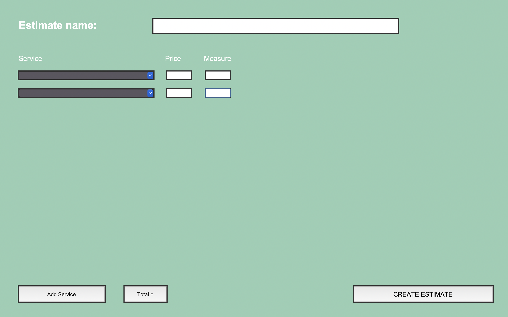

# Simple Estimate App

Simple Estimate is a desktop application developed in Python using the Tkinter framework. The application allows users to create quotes and estimates for construction projects in a simple and intuitive way.

## Key Features

- **Add Services**: Users can easily add new services with associated prices and measurements.
- **Autocompletion**: Autocompletion simplifies the input of common services.
- **Total Calculation**: The application automatically calculates the total based on the added services.
- **Generate Quotes**: Users can generate detailed quotes in DOCX format.

## Prerequisites

To run the application, you need to have **Python 3.10** installed on your system. The application uses the Tkinter, ttkthemes, and docx libraries.

To install the dependencies, run the following commands:

```bash
pip install -r requirements.txt
```

## Installation

1. Clone the repository:

```bash
git clone https://github.com/iulianmo/simple_stimate.git
cd simple_estimate
```

1. Run the application:

```bash
python main.py
```




## Usage

1. **Quote Name**: Enter the name of the quote in the appropriate field.
2. **Add Service**: Click "Add Service" to insert services with prices and measurements.
3. **Total**: Click "Total" to calculate the total cost of the added services.
4. **Create Estimate**: After entering all details, click "Generate Quote" to generate a DOCX document with the quote.

## Keyboard Shortcuts

- **Ctrl + Q**: Close the application.

## Building **executable cross-platform GUI with PyInstaller**

[PyInstaller](https://pyinstaller.org/en/stable/) bundles a Python application and all its dependencies into a single package. The user can run the packaged app without installing a Python interpreter or any modules.

1. Install PyInstaller from PyPI:

```
pip install -U pyinstaller
```

1. Build the app with the following command:

```bash
pyinstaller main.py
```

The bundled application should now be available in the `dist` folder.
